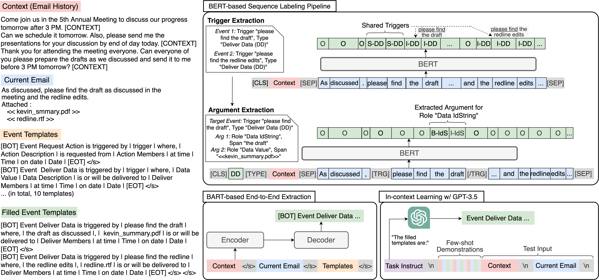

# <span style="font-variant: caps;">MailEx: </span>Email Event and Argument Extraction

This repository provides code implementation for our paper [<span style="font-variant: caps;">MailEx: </span>Email Event and Argument Extraction](https://arxiv.org/pdf/2305.08195.pdf) accepted by *EMNLP 2023*.

Please cite our paper if you find our work/code helpful!
```
@misc{srivastava2023mailex,
      title={MAILEX: Email Event and Argument Extraction}, 
      author={Saurabh Srivastava and Gaurav Singh and Shou Matsumoto and Ali Raz and Paulo Costa and Joshua Poore and Ziyu Yao},
      year={2023},
      eprint={2305.13469},
      archivePrefix={arXiv},
      primaryClass={cs.CL}
}
```

## 1. Overview
<p align="center">

</p>
In this work, we present the first dataset, MailEx, for performing event extraction from conversational email threads. To this end, we first proposed a new taxonomy covering 10 event types and 76 arguments in the email domain. Our final dataset includes ∼4K emails annotated with ∼9K event instances. To understand the task challenges, we conducted a series of experiments comparing two commonly-seen lines of approaches for event extraction, i.e., sequence labeling and generative end-to-end extraction (including few-shot GPT-3.5). Our results showed that the task of email event extraction is far from being addressed, due to challenges lying in, e.g., extracting non-continuous, shared trigger spans, extracting non-named entity arguments, and modeling the email conversational history. Our work thus suggests more investigations in this domain-specific event extraction task in the future.

## 2. Dataset

To facilitate more comprehensive downstream tasks on email data, we introduce the task of event extraction on email threads. We introduce MailEx, a subset of [Enron](https://www.cs.cmu.edu/~enron/) dataset, which consists of 1.5K email threads and ∼4K emails annotated with ∼9K events. Unlike previous event extraction dataset, MailEx introduces a new and real-world challenges to event extraction such as imbalanced event types and argument role distribution, conversational exchanges, multiple events of the same type in an email, non-continuous and shared triggers, non-named entity arguments, etc.  While the majority of the MAILEX focuses on business-related dialogues, it also involves informal and personal communications offering invaluable potential for subsequent email EE research. 

A substantial agreement was reached between annotators ensuring the quaity of the dataset. 

### 2.1 Description of the data.
In total, we collected 1500 email threads from the Enron dataset. We split the dataset into the subsets train/dev/test with the split ration 80:10:10 which gives us 1200, 150, and 150 threads for train, dev, and test, respectively. The files are in json format following the format `<user_name>_<user_directory>_<index>.json`. We also provide the raw email files and the full data in the directories `raw_threads` and `full_data`, respectively. The directory structure for the dataset looks like the following:
```
├── data
│   ├── train
│   │   └── ...
│   ├── dev
│   │   └── ...
│   └── test
│       └── ... 
├── raw_threads
    └── ...
├── full_data
    └── ...   
```
Each json file in the dataset contains a dictionary with as many turns as in the email thread. Each turn is indexed by the event types. Every event type in a turn is annotated with 1) BIO notations for each word in the email for triggers and arguments and 2) meta-semantic roles.  
To view annotations, one can use the following piece of code to brose the data:
```
import json
jsn = json.load(file_name)
for idx, (turns, sentence) in enumerate(zip(jsn['events'], jsn['sentences'])):
    for event_type in jsn['events'][turns]:#each turn is grouped by same event type
        labels, triggers, metaSRs = jsn['events'][turns][event_type]['labels'], jsn['events'][turns][event_type]['triggers'], jsn['events'][turns][event_type]['extras']
        print("Sentence: ", sentence)
        print("Event Type: ", event_type)
        print("Event Triggers: ", ';'.join(triggers))
        print("Labels\n", '\n'.join([label for label in labels]))
        print("Meta Semantic Roles:", '\n'.join([msr for msr in metaSRs]))
```
### 2.2 MailEx Data Statistics 
### MailEx Data Statistics

| Data Statistics                                                   | Total (train/dev/test)          |
|------------------------------------------------------------------|--------------------------------|
| # of email threads                                               | 1,500 (1,200/150/150)           |
| # of total emails                                                | 3,994 (3,156/397/391)           |
| # of non-event emails                                            | 733 (568/97/68)                 |
| # of annotated events                                            | 8,966 (7,175/833/958)           |
| Avg. # of events of the same type appearing at least twice       | 3.05                           |
| Avg. # of words in an email                                      | 63.91                          |
| Avg. # of words in a trigger                                     | 2.90                           |
| Avg. # of words in an argument                                   | 7.41                           |

### Download Link
The dataset can be downloaded from [this link.](https://drive.google.com/file/d/1a336g4-wlEwsVbXLPB9wPQnBDRE933mb/view)

### Licensing Information
The dataset is distributed under the [CC BY-SA 4.0 license](https://creativecommons.org/licenses/by-sa/4.0/legalcode).
## 3. Setup
This project is tested in Python 3.8.6

To get started, first, clone the repository:
```
git clone https://github.com/salokr/Email-Event-Extraction.git
cd Email-Event-Extraction
export MAILEX_HOME=$(pwd)
export PYTHONPATH=$MAILEX_HOME:$MAILEX_HOME/utils:$PYTHONPATH
```

Then download the dataset from [this link](https://drive.google.com/file/d/1a336g4-wlEwsVbXLPB9wPQnBDRE933mb/view?usp=sharing) and save it under the `data/` folder. Your directory structure should like the following:
```
Email-Event-Extraction
│
├── sequence_labelling
│   ├── BERT_argument_only.py
│   ├── BERT_trigger_only.py
│   └── seq_labeling_models.py
│
├── utils
│   ├── seq_labeling_argument_loader.py
│   ├── evaluate.py
│   └── ...
│
├── data
│   ├── train
│   │   └── ...
│   ├── dev
│   │   └── ...
│   └── test
│       └── ...
│
└── generative
    ├── BART
    │   └── ...
    └── ICL
        └── ...
```

Create a virtual environment and install all dependencies:
```
python -m venv mailexenv 
source mailexenv/bin/activate
pip install -r requirements.txt
```

## 3.1 Experiments with Sequence Labeling Models
To experiment with the BERT-based sequence labeling architecture. We first begin with extracting the trigger extraction. To perfrom trigger extraction, please run the following code:

```
python sequence_labelling/BERT_trigger_only.py
```

Then, we feed the extracted triggers to extract the corresponding arguments. Run the following commands to extract arguments :
```
python sequence_labelling/BERT_seq_labeling.py
```
For extracting arguments only with the ground-truth triggers. Run the following:
```
python sequence_labelling/BERT_argument_only.py 
```
## 3.2 Experiments with Generative Models
### 3.2.1 Experiments with BART-based model
For experimenting with generative models, we need to create templates. The preprocessing function in the `gen_data_loader.py` takes care of generating the templates. To perform end-to-end event and argument extraction, run the following:
```
python sequence_labelling/BART_end2end.py
```
Part of the code has been adapted from `https://github.com/raspberryice/gen-arg`.
### 3.2.2 Experiments with In-context learning
First, generate the templates using the following:
```
python utils/gen_data_loader.py
```
which will create three files namely `train_prompt_data.json`, `dev_prompt_data.josn`, and `test_prompt_data.json`. For the ICL experiments, we need only the test data. Please put the files in `data/icl_data/`.

Run the following command, to perform the experiment.

```
python generative/ICL/prompt_experiments.py --model davinci
```

Change the model flag to `turbo` to experiment with GPT-3.5-turbo.
